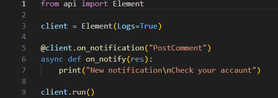

# elementLib
Данная библиотека на Python нацелена на более простой способ использования elemsocial.com API

# 🛠 Использование
Для начала я вам дам пример и разберу его 

## 3 строка
Cоздает объект client с использованием класса Element который так сказать подготавливает к использованию
Аргументы (помеченные * значит важные)
sessID - назначает имя сессии (по умлочанию anon)
Logs - включает логи (по умолчанию False)

## 5 Строка
это декоратор который вызывает в моем случае функцию on_notify когда приходит уведомление PostComment то есть прокомментировали мой пост
Аргументы (помеченные * значит важные)
Action - тип уведомления (по умолчанию False и оно вызвает при любом уведомлении)

## 6 строка
Это асинхронная (далее async) функция которая вызывается при уведомлении PostComment дается ей res в котором есть
notify - само уведомление которое получается через API
async reply - отвечает на комментарий с вашим текстом
async send - отправляет комметарий без ответа

## 9 строка
Это полный запуск и подключение к вашему аккаунту
Аргументы (помеченные * значит важные если идет цифра значит это arg а не kwarg)
0* - почта | ключ существующей сессии
1 - пароль
либо без аргуметов если у вас есть {sessID}.session (см. 3)

В {sessID}.session хранится жсон
{"S-Key": "ключ сессии"}

Здесь по сути все тоже самое
## 5 строка
Декоратор который вызывает функцию on_newpost и дает аргумент post 
Аргументы (помеченные * значит важные)
Type - тип постов могут быть LATEST (последние), REC (рекомендации), SUBSCRIPTIONS (подписки)
